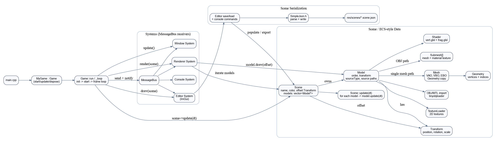

Nelson is a game engine and editor that is currently under development. The purpose of this project is to create a small and portable game engine as a playground for prototyping games.

## Requirements
Supports `macOS` and Debian-based Linux distros.

- C++17 compiler (`g++`/`clang++`)
- CMake (3.1+)
- OpenGL development libraries

## Dependencies
This project vendors most dependencies directly in the repo:

- [GLEW](https://github.com/nigels-com/glew) - OpenGL extension loading
- [GLFW](https://github.com/glfw/glfw) - windowing/input/context
- [GLM](https://github.com/g-truc/glm) - math library
- [SOIL2](https://github.com/SpartanJ/SOIL2) - texture/image loading
- [Dear ImGui](https://github.com/ocornut/imgui) - editor UI
- [tinyobjloader](https://github.com/tinyobjloader/tinyobjloader) - OBJ/MTL model loading

Scene serialization currently uses an in-tree parser/writer:

- `src/SimpleJson.h` - lightweight internal JSON parser/writer (no external JSON dependency)

## Architecture
The editor/runtime follows a lightweight ECS-style flow with JSON scene I/O.



## Project Layout
Project-specific content now lives under `projects/<project-name>/`:

```
projects/
  default/
    project.json
    scenes/
      default.scene.json
    assets/
      models/
        sponza/
```

Shared fallback assets remain in `res/` (for common shaders/images and legacy scenes).

## Quick Start on Linux
```
sudo apt install cmake build-essential libglew-dev libglfw3-dev libglm-dev libgl1-mesa-dev libxinerama-dev libxcursor-dev libxi-dev
mkdir -p build
cd build
cmake ..
make
```

Run from project root:
```
./Nelson
```

Run with an explicit startup scene JSON:
```
./Nelson projects/default/scenes/default.scene.json
```

---

## Features

- Load and display 3D models
- Basic scene management (load/save)
- Simple UI for editing scene properties
- Real-time rendering with OpenGL